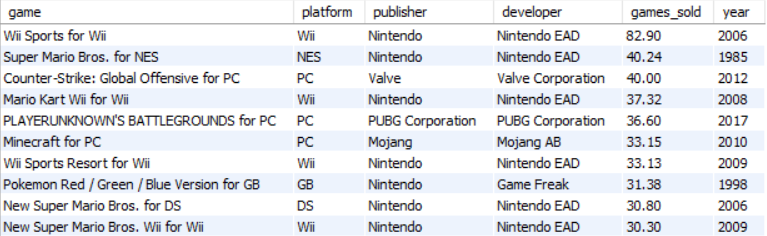
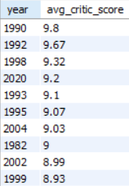
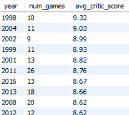
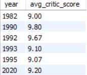
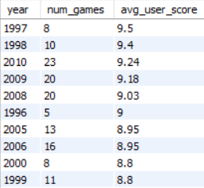
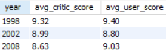
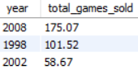

------------------------------------------------------------------------

# When was the Golden Age of Video Games?

Golden ages in video games signify transformative periods marked by significant innovation, cultural impact, and technological advancements within the industry. These eras have shaped gaming into a global phenomenon, introducing iconic games and establishing enduring trends. For example, the arcade boom of the late 1970s and early 1980s popularized classics like Pac-Man and Donkey Kong, while the 1990s console wars between Sega and Nintendo brought forth franchises such as Super Mario and Sonic the Hedgehog. These milestones not only pushed the boundaries of technology but also laid the groundwork for modern gaming trends like online multiplayer and indie game development. Understanding these historical periods provides insights into the evolution and enduring popularity of video games worldwide.   

   Even though the dataset had information on around 20,000 video games, only the top 400 video games by the number of copies they sold have been taken for analysis in this project. So,let's go ahead and find out the golden age of video games!  

## The top selling video games of all time

  Okay, so let's get started. First we'll look at which were the most popular video games in this period, which is decided on the basis of how many copies of each game was sold.   

   As you can see, the results are quite interesting. The list of top 10 video games with most copies sold dates back to as far as 1982 and as recent as 2017(read PUBG).  

## Years that the critics loved

  That is indeed quite the range and now let's look at the reviews for gaining a little more information about that. Now, there are lots of ways of knowing about the responses of each video game but who's better at judging things than the purists, the connoisseurs: the critics.   

   It seems that most of the years with high average critic scores for video games lie between 1990 to 2004, with two exceptions: 1982 and 2020.  

## Are we missing something?

  Coming to those exceptions in the past years, one may wonder how can 2020 be among the best years for video games when the whole world was under lockdown due to the pandemic and hardly any games got released. To see if these years were actually that good for video games, we apply a criteria of having released more than 4 games for each year in our dataset.   

   And see! The year 2020 is not among the list of such years, which means that our hypothesis was correct and those two outlier years no longer exist as the top 10 years.  

## The foundation laying years

  But upon closer inspection and comparison between the results of the previous two queries one could tell that it was not only 1982 and 2020 that got removed but a few of the other years were also having a lesser number of entries in our dataset. As the range of best years by critic scores has shifted to 1998 to 2017, I wonder what were those years that got filtered out.   

   In fact, there were six years out of the initial list of 10 that we generated which were filtered out later. Looking closely, it is understandable as, with the exception of 2020 as previously discussed, these years were mostly the ones during the early days of gaming when the market was still learning to hold its ground and these few popular games released during these would potentially be the ones which allowed the field to be the giant that it became later on.  

## Where has all the craze gone?

  Now it's time to see the years when the craze of the video games were at its peak. For this, we'll query the database in the same manner as we did earlier for critic scores but this time use players as our field of interest instead of critics.   

   And on the basis of the results of our query, we can conclude that the video games popularity was at its peak during mid 90s late 2000s.  

## The best years

  Remember our initial goal of finding the golden age of video games? Now it feels like we are getting close to it. As we have already identified the best years by both the critics as well as the players, what remains is to find out the years that were like by both critics and players alike. For this we would find out the common years between our two tables that comprise of top 10 critic years and top 10 player years.   

   It's quite clearly evident that the years 1998, 2002 and 2008 are the three years where both critics and players agree on their opinion about the video games.  

## And the golden year award goes to...

  Now that we've got the years that both users and critics agreed were in the top ten, we should look at other metrics for determining how good were the performance of video games during those years. We know that critics and players liked these years, but what about video game makers? Were sales good? Let's go ahead and find out!   

   This time we'll have to use the query from the previous task as a subquery in this one to determine our desired metrics. And as you may see, while 2008 and 1998 have produced brilliant results in video game sales, the same cannot be said about 2002. And on the basis of our results, we can definitely conclude that all the metrics taken into consideration, 2008 edges out 1998 as the best year for video games
